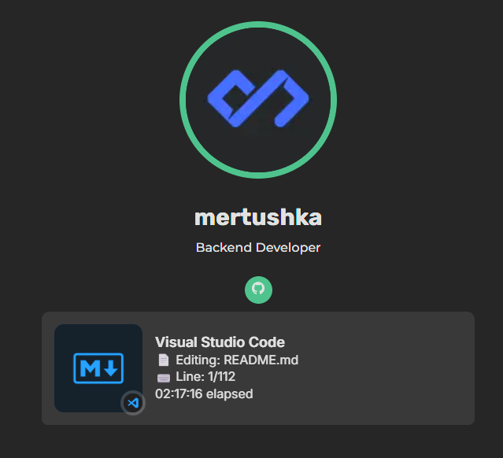
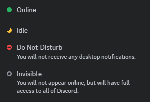

<h1 id="title" align="center">Personal Website</h1>

<h4 align="center">This is my personal portfolio, coded while learning Next.JS!</h4>

### 🔖 Table Of Contents

- 🤔 [How To Use](#how-to-use)
- ⚙️ [Configuration](#configuration)
- 🚀 [Technologies](#technologies)
- 🎊 [Features](#features)
- 💡 [How To Contribute](#how-to-contribute)
- 🤗 [Contributors](#contributors)
- 👤 [Author](#author)
- 🔏 [License](#license)

---

<h2 id="how-to-use">🤔 How To Use</h2>

### 💻 Deploy with Vercel

---

<h2 id="configuration">⚙️ Configuration</h2>

- Edit configuration files in `/src/data/` and you are done!

---

<h2 id="technologies">🚀 Technologies</h2>

- 

[Back To The Top](#title)

---

<h2 id="features">🎊 Features</h2>

### **Incredibly Fast, Accessible, Secure, SEO Improved**

### **Real-time Discord Status**

- Image, Username and Discord Rich Presence (VSCode, Spotify etc)

- Site skins (Default: Invisible)

### **Responsive**

### **Mobile Friendly**

- Detecting swipe events & toggle navbar

[Back To The Top](#title)

---

<h2 id="how-to-contribute">💡 How To Contribute</h2>

- Make a fork of this repository
- Clone to you machine and entry on respective paste
- Create a branch with your resource: `git checkout -b my-feature`
- Commit your changes: `git commit -m 'feat: My new feature'`
- Push your branch: `git push origin my-feature`
- A green button will appear at the beginning of this repository
- Click to open and fill in the pull request information

<i>Contributions, issues and features requests are welcome!</i> 
<i>📮 Submit PRs to help solve issues or add features</i> 
<i>🛠Find and report issues</i> 
<i>🌟 Star the project</i> 

[Back To The Top](#title)

---

<h2 id="contributors">🤗 Contributors</h2>

<a href="https://github.com/mertushka">

[Back To The Top](#title)

---

<h2 id="license">🔏 License</h2>

Copyright © [mertushka](https://github.com/mertushka)

This project is licensed by [MIT License](https://api.github.com/licenses/mit).

[Back To The Top](#title)

---
